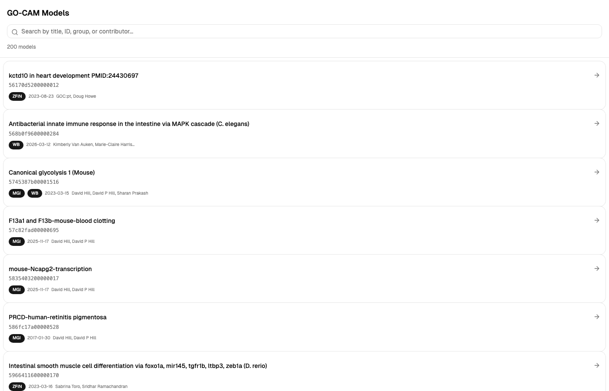
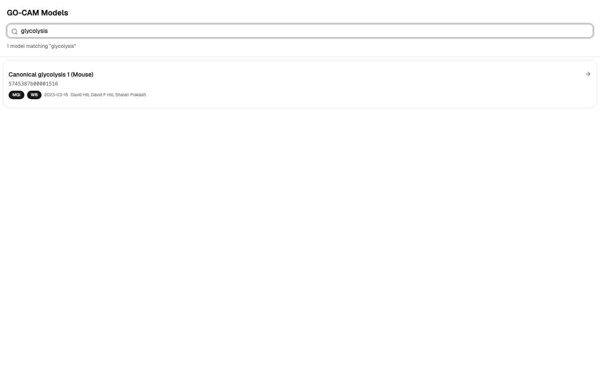
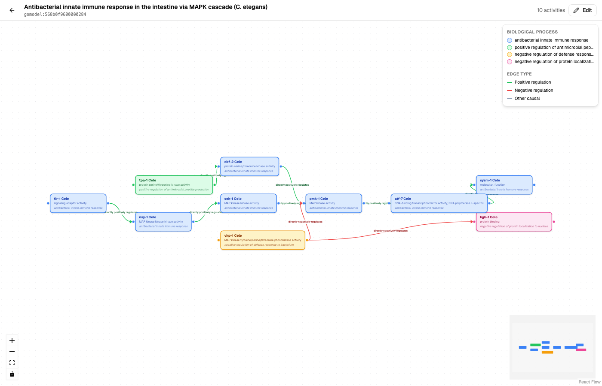
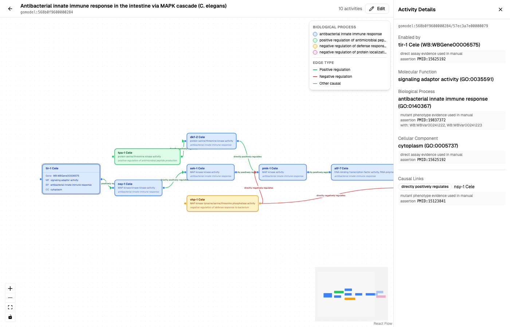
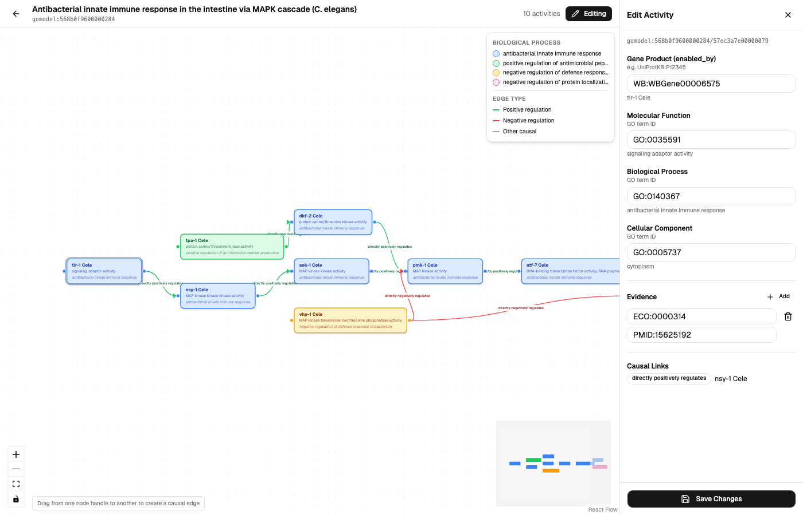
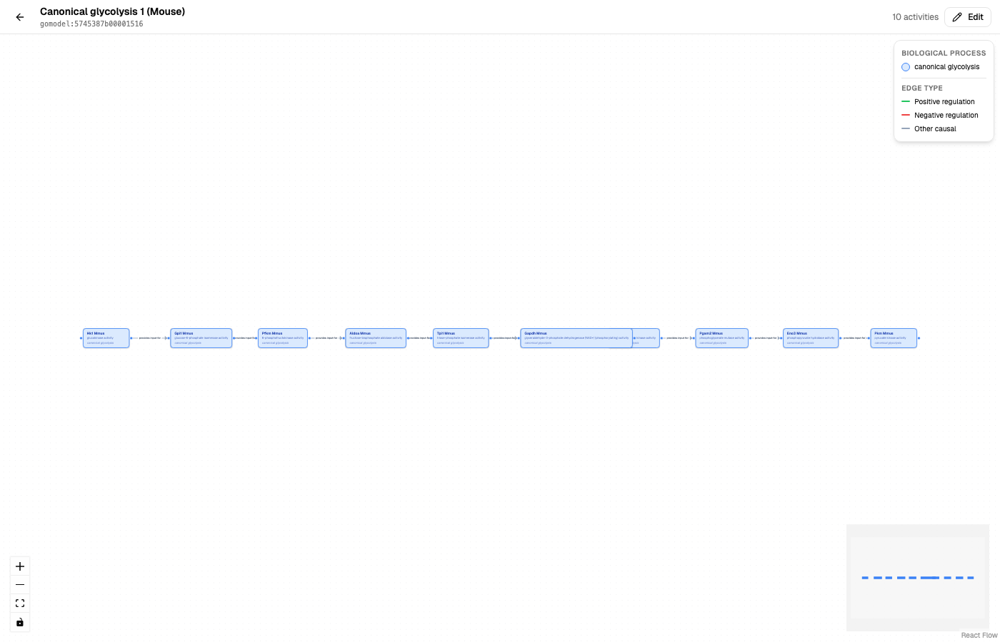

# Features

## Model Browser

Searchable list of GO-CAM models fetched live from the Gene Ontology API. Filter by title, model ID, contributor name, or annotation group.

Each card shows the model title, ID, contributing groups (ZFIN, WB, MGI, etc.), last modified date, and contributor names.

---

## Graph Visualization

Click any model to open its activity graph rendered with [React Flow](https://reactflow.dev/).

### Nodes

Each node represents a **molecular activity** — a gene product performing a molecular function:

- **Label**: Gene product name (e.g., "tir-1 Cele")
- **Sublabel**: Molecular function (e.g., "signaling adaptor activity")
- **Color**: Biological process annotation

### Edges

Edges represent **causal associations** between activities:

| Color | Meaning | Example predicates |
|-------|---------|-------------------|
| Green | Positive regulation | directly positively regulates, directly activates |
| Red | Negative regulation | directly negatively regulates, directly inhibits |
| Gray | Other causal | provides input for, causally upstream of |

### Legend

The overlay legend in the top-right shows:

- All biological processes in the model with their assigned colors
- Edge type color key

### MiniMap

The bottom-right minimap shows the full graph with process-colored nodes for quick orientation.

---

## Semantic Zoom

Click any node to see its full details:

### Inline Expansion

The node expands to show:

- **Gene**: Gene product identifier (e.g., WB:WBGene00006575)
- **MF**: Molecular function GO term
- **BP**: Biological process GO term
- **CC**: Cellular component GO term

### Detail Panel

The right sidebar shows the complete activity record:

- Gene product with resolved label
- Molecular function with evidence (ECO codes, PMIDs)
- Biological process with evidence
- Cellular component with evidence
- Causal links to downstream activities

---

## Editing

Toggle edit mode with the **Edit** button in the header.

### Activity Editing

Click any node in edit mode to open the edit panel:

- **Gene Product** — edit the gene product identifier (e.g., UniProtKB:P12345)
- **Molecular Function** — edit the GO term ID
- **Biological Process** — edit the GO term ID
- **Cellular Component** — edit the GO term ID

Each field shows the resolved term label below for confirmation.

### Evidence Editing

- Add new evidence rows with ECO code and PMID reference
- Remove existing evidence rows
- Evidence is saved with the activity update

### Creating Causal Edges

In edit mode, drag from one node's handle to another to create a new causal association:

1. Drag from the source node's right handle to the target node's left handle
2. A dialog appears with a predicate picker
3. Select the relationship type (e.g., "directly positively regulates")
4. Click "Create Edge"

The new edge appears immediately on the graph.

---

## Multiple Pathway Types

The editor handles different pathway topologies:

- **Branching cascades** (e.g., MAPK signaling) with multiple parallel paths
- **Linear pathways** (e.g., glycolysis) with sequential enzyme chains
- **Complex networks** with mixed positive and negative regulation
